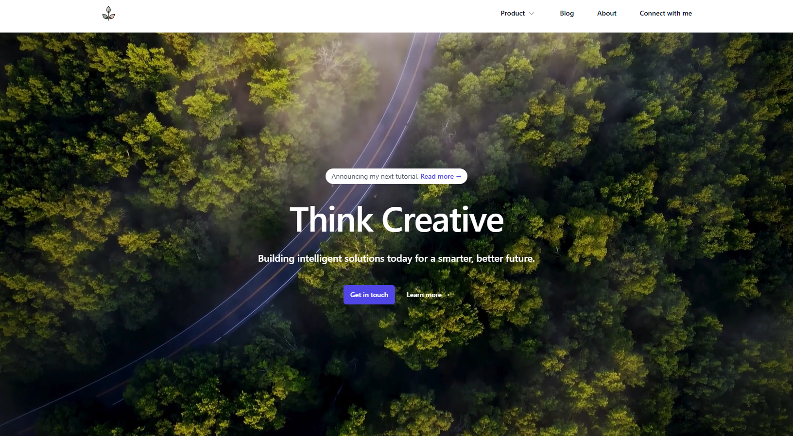

# Portfolio Website

This repository contains the code for my personal portfolio website. The website showcases my projects, achievements, and contact information in a user-friendly layout.




## Table of Contents

- [Overview](#overview)
- [Features](#features)
- [Technologies Used](#technologies-used)
- [Installation](#installation)
- [File Structure](#file-structure)
- [Components](#components)
- [Contributing](#contributing)
- [License](#license)

## Overview

This portfolio website is designed to present my professional background, project experience, and skills in a visually appealing and organized format. The website is structured with multiple sections, each highlighting a different aspect of my work and achievements.

## Features

- **Hero Section**: A welcoming section introducing myself.
- **Portfolio Section**: Highlights a selection of my most significant projects.
- **Blog Section**: Displays insights and articles relevant to my field.
- **About Section**: Provides background information about my professional journey.
- **Recommendations Section**: Shows testimonials from people I have worked with.
- **Contact Form**: Allows visitors to reach out for inquiries or collaborations.
- **Footer**: Social media links and additional information about this site.

## Technologies Used

- **React**: JavaScript library for building user interfaces.
- **Tailwind CSS**: Utility-first CSS framework for styling.
- **JavaScript**: Core programming language for web development.
- **HTML** & **CSS**: Markup and styling for the website structure and layout.

## Installation

To set up this project locally, follow these steps:

1. **Clone the repository**:
   ```bash
   git clone https://github.com/yourusername/portfolio-website.git
   ```
   
2. **Navigate to the project folder**:
   ```bash
   cd portfolio-website
   ```

3. **Install dependencies**:
   ```bash
   npm install
   ```

4. **Run the development server**:
   ```bash
   npm start
   ```

   The site should now be running locally at `http://localhost:3000`.

## File Structure

The project is organized as follows:

```
portfolio-website/
├── public/                   # Public assets and favicon
├── src/
│   ├── assets/               # Images, logos, and other media
│   ├── components/           # React components for each section
│   │   ├── About.js          # About section
│   │   ├── Blog.js           # Blog section
│   │   ├── ContactUs.js      # Contact form section
│   │   ├── Footer.js         # Footer with social links
│   │   ├── Hero.js           # Hero section
│   │   ├── Portfolio.js      # Projects showcase
│   │   ├── RecQuo1.js        # Recommendation quote 1
│   │   └── RecQuo2.js        # Recommendation quote 2
│   ├── App.js                # Main App component
│   ├── index.js              # Entry point for React
│   └── App.css               # Global styles
└── README.md                 # Project documentation
```

## Components

Each section is built as a separate component to maintain modularity and reusability.

- **Hero**: The introductory section at the top of the website.
- **Portfolio**: Displays key projects, using components like `Card` and `ReverseCard` for layout.
- **Blog**: Lists recent blog posts or insights.
- **About**: Information about my professional journey and background.
- **Recommendations**: Displays quotes from colleagues or supervisors.
- **Contact Us**: A form where users can reach out.
- **Footer**: Links to social media and a note about the project.

## Contributing

If you'd like to contribute, feel free to fork the repository and submit a pull request.

## License

This project is licensed under the MIT License - see the [LICENSE](LICENSE) file for details.